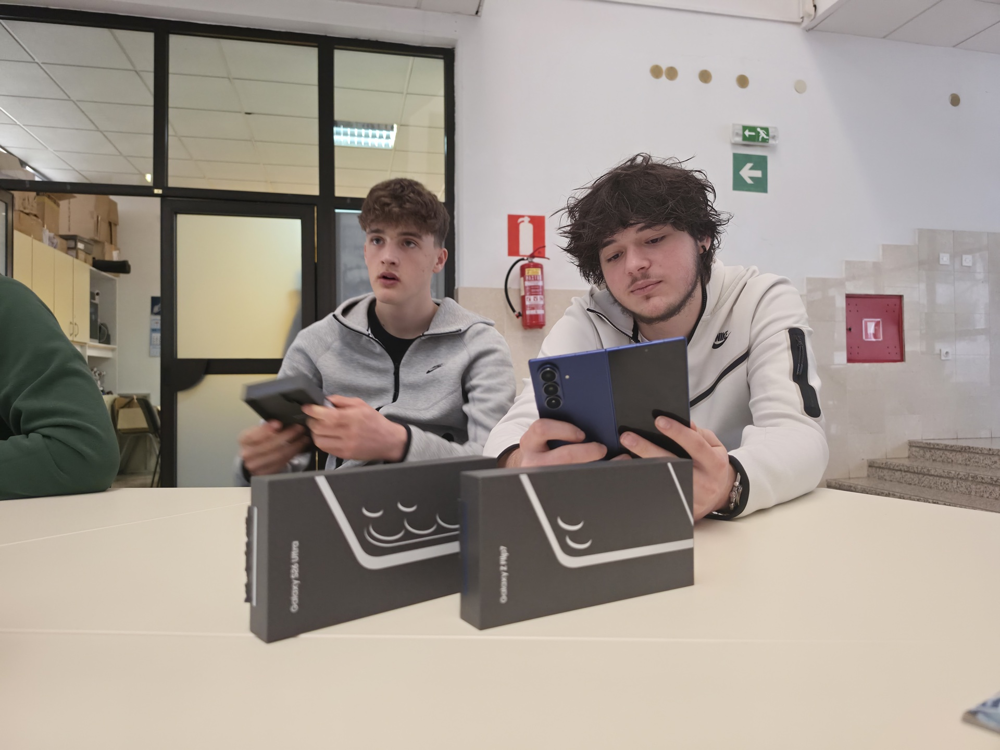
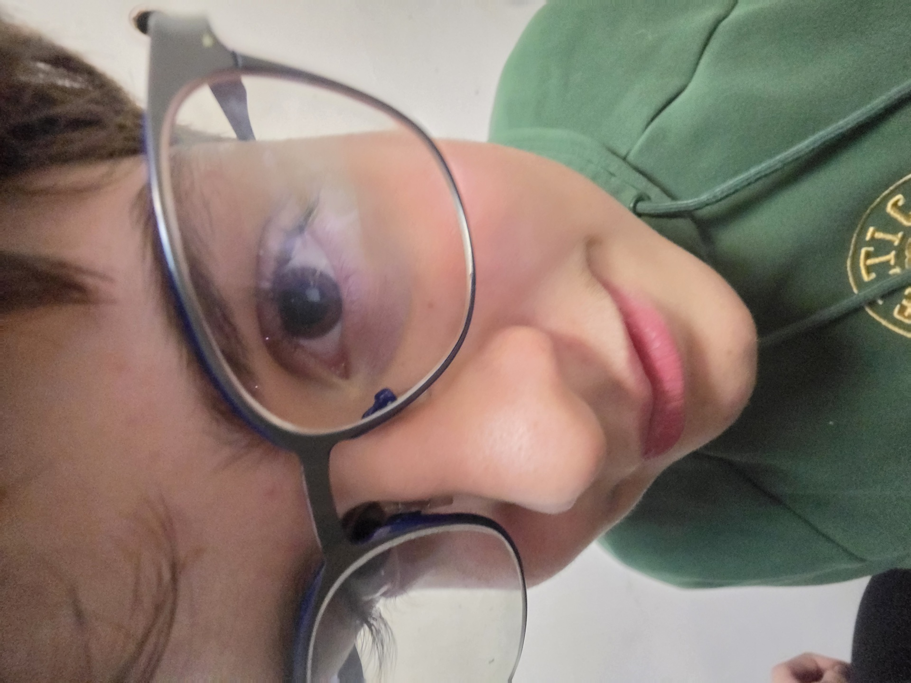
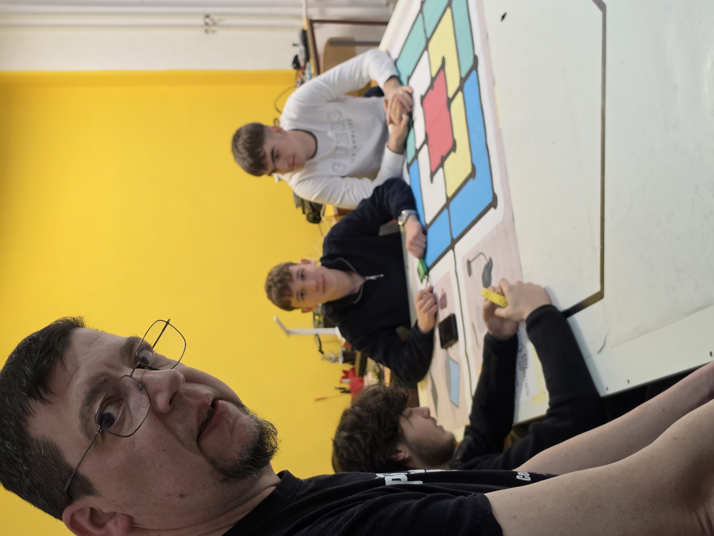
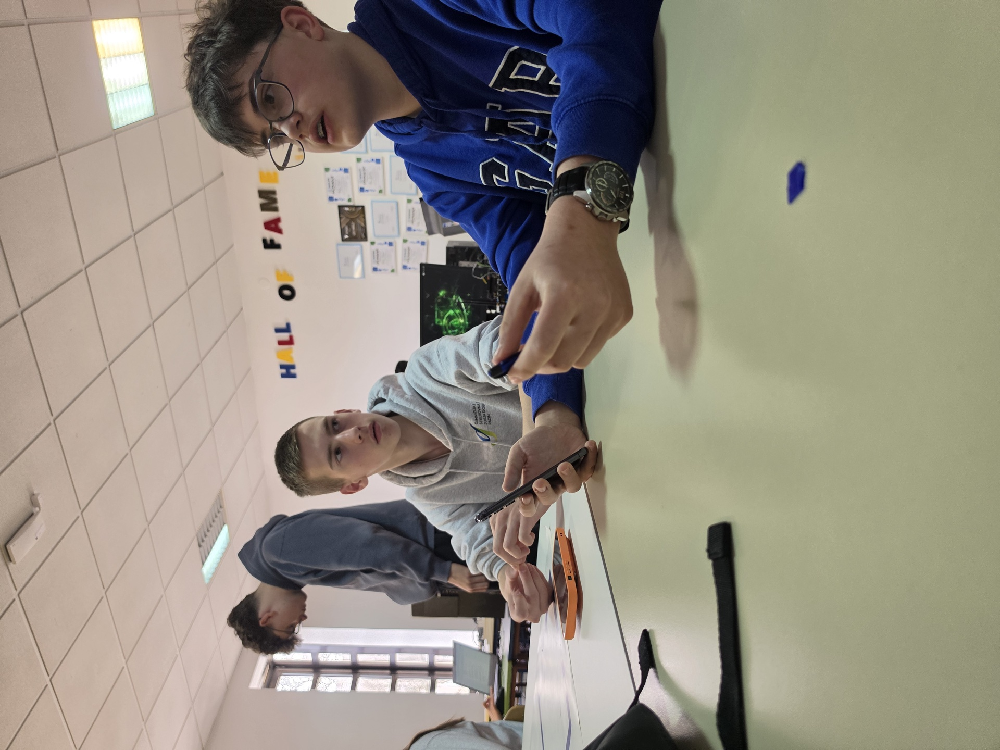
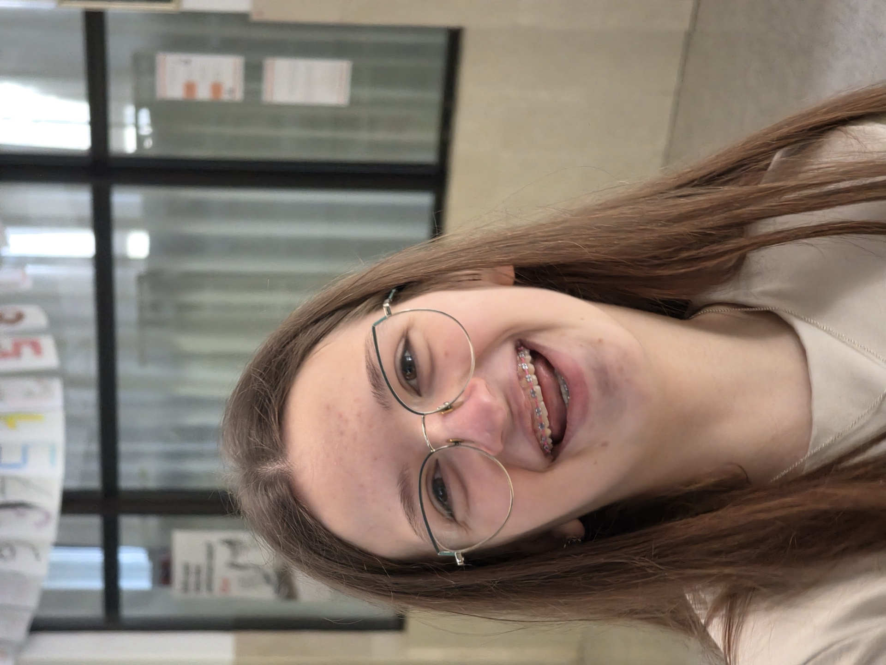

## 11. ožujka

Sve je počelo u školskoj radionici. Mi smo razred 1.a, prirodoslovno-matematička gimnazija, u Gimnaziji i strukovnoj školi Jurja Dobrile u Pazinu, a u ekipi za ovaj projekt nas je pet: Filip, Eva, Jura, Luana i Alen. Vodi nas profesor Lovro Šverko.

Na stol su nam stavili dvije kutije i u prvih pola sata se nije događalo ništa pametno. Samo raspakiravanje. Galaxy S26 Ultra i Z Flip7. Tko će prvi probati kameru, je li novi telefon brži od onog što već imamo u džepu, gdje ide kabel. Profesor nas je pustio sat vremena samo da se igramo, a onda je sjeo s nama da popričamo o čemu je zapravo cijela priča.

## Igrali smo se s kamerom

Ostatak prvog dana proveli smo testirajući kameru po hodnicima. Selfie, portret prema svjetlu, protiv svjetla. Ništa pametno, samo da vidimo kako se telefon ponaša.

Portret je radio i u onom umrlom svjetlu školskih neonki. To nas je smirilo, jer smo znali da nećemo morati nositi dodatne lampe svaki put kad idemo razgovarati s nekim.

## 18. ožujka, drugi sastanak

Tjedan poslije smo se okupili da posložimo koga ćemo zvati. Profesor je donio prvu mapu istraživanja, a mi smo počeli zapisivati pitanja. Tema: turizam u Istri, ali iz više različitih kutova. Brojke s jedne strane (Turistička zajednica), zanati s druge (Obrtnička komora), pa korporacija (Valamar), grad (gradonačelnica), unutrašnjost (AZRRI), škola i mjesto (Korlević), komunalno (Usluga Poreč).

Plan smo posložili u Note Assistu na Tabu. Kartica za svakog sugovornika, lista pitanja, i mjesto za ono što očekujemo da ćemo dobiti kao odgovor. Ono što smo zapravo dobili na razgovorima često se nije poklapalo s tim, ali to nam je i bilo zanimljivo.

Iza nas na zidu je "Hall of Fame", priznanja iz prijašnjih projekata škole. Nismo si rekli ništa heroično tipa "i mi ćemo tu završiti". Nego smo si rekli da nam ovaj projekt ne bude samo za ocjenu, jer tema, kuće za odmor, mladi koji odlaze, sve je to nešto što tu kod nas vidimo svaki dan.

## 25. ožujka, finalni testovi

Tjedan prije prvog izlaska još smo isprobali daljinski okidač i koliko nam Voice Recorder dobro hvata zvuk u sobi s ehom. Snimali smo se međusobno da vidimo kako izgledaju portreti u prirodnom svjetlu hodnika.

Dogovorili smo i tehničku stvar koja nas je vodila do kraja: sve sugovornike snimamo u LOG profilu na S26 Ultri, neovisno o lokaciji. Razlog je jednostavan, ne znamo koliko ćemo svjetla imati na svakom mjestu, a u LOG-u nam ostaje najviše prostora da to popravimo poslije.

Te fotke smo pustili kroz Photo Assist (Object Eraser nam je obrisao zaposlenika koji je slučajno prošao u pozadini). Bilo nam je važno da bilo koji alat koji ćemo koristiti na terenu prvo nekako prođemo kroz ruke u školi, da nam prvi put isprobavanja ne bude pred sugovornikom.

## Sutra

Prvi pravi izlazak. Turistička zajednica Istarske županije ujutro, Obrtnička komora popodne. Brojke s jedne strane, ljudi koji još drže čekić u rukama s druge.
