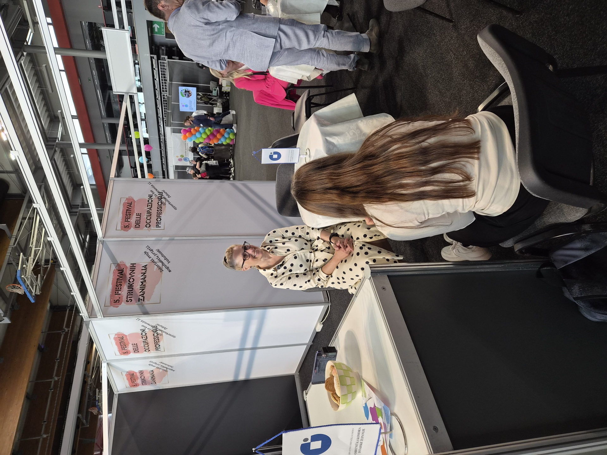

## 13. travnja

Krenuli smo iz škole u dva tima. Jedan u Turističku zajednicu, drugi na 5. Festival strukovnih zanimanja, gdje je svoj štand imala Obrtnička komora. Htjeli smo isti dan čuti dvije različite strane priče o istom mjestu.

## U Turističkoj zajednici

Pitanja smo pripremali tjedan dana ranije i, gledajući sad, pola ih je bilo preširoko. Ova četiri su nam dala najviše:

- Kako se broj turista u Istri kretao zadnjih petnaest godina i u kojim mjesecima najviše?
- Koliko se domaćih ljudi zapošljava u turizmu, a koliko sezonaca dolazi izvana?
- Gdje vide da infrastruktura ne stiže pratiti sezonu?
- Imaju li u svojim popisima primjer agroturizma ili OPG-a koji radi pametno?

Cijelu snimku ne objavljujemo, ona ide u mapu projekta. Ali jedna stvar nam se stalno vraćala u glavu. Pričali su o "razdobljima velikih udara", ona dva-tri tjedna u lipnju i kolovozu kad se odjednom u jednom mjestu nađe više ljudi nego inače u par mjeseci zajedno.

## Festival strukovnih zanimanja

Druga ekipa je istog popodneva otišla na Festival. Pored škola, tu su bili i predstavnici obrtnika, pa smo razgovor vodili na njihovom štandu. Sajamska dvorana, bučna kao tržnica, i nije bilo lako hvatati zvuk. Ali pitanja su odmah otišla u jedan drugi smjer:

- Koji su zanati danas u opasnosti? Stari (kovač, klesar), ili neki drugi?
- Zašto mladi sve teže preuzimaju obrt? Je li samo do novca, ili je do toga da je "raditi u turizmu" sad nekako finije od "biti majstor"?
- Što ljudi koji su otišli iz Istre kažu kao glavni razlog?
- Postoji li razlika između onih koji odlaze u Zagreb i onih koji odu van zemlje?

Dobili smo više otvorenih pitanja nego odgovora. To nam je bilo OK, jer smo i krenuli s tom logikom.

## Kratko o snimanju

Snimali smo na S26 Ultri, video u LOG profilu. Voice Recorder je radio transkripciju uživo, pa smo bilješke pisali na Tabu i odmah označavali zanimljive trenutke. Navečer smo kroz Object Eraser maknuli stvari u pozadini koje su odvlačile pažnju s portreta i pustili Note Assist da nam napravi sažetak bilježaka, da imamo polazište za sutra.

## Što smo donijeli kući

Iz prvog dana imamo dvije slike koje nam se u glavi ne uklapaju lako. Brojke kažu jedno, ljudi koji su bliže terenu kažu drugo. Nije nam još jasno gdje se to spaja. Sljedeći tjedan: Valamar, gradonačelnica, AZRRI, Korlević.
