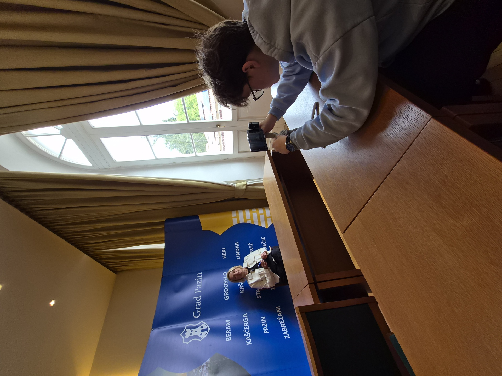

## 21. travnja

Drugi tjedan terena započeli smo s dva razgovora koja smo u glavi bili posložili kao "firmsku" i "gradsku" stranu iste priče. Ujutro Valamar, popodne gradonačelnica Pazina, Suzana Jašić. Iskreno, prije ulaska nismo imali jasan stav o tome što ćemo čuti, i namjerno smo to tako ostavili.

## U Valamaru

Pripremili smo niz pitanja oko brojeva, dolazaka i zaposlenika:

- Kako im se kreće broj gostiju zadnjih petnaest godina i koji im je smještaj najtraženiji?
- Što gosti, prema njihovu iskustvu, traže kad dođu u Istru?
- Koliko domaćih radnika zapošljavaju u odnosu na strane, i kako se taj omjer mijenja kroz godinu?
- Što kao firma rade da bi se mogli zvati "održivima"? Koliko je tu reklame, a koliko stvarnog rada?
- Znaju li za neki manji projekt, OPG ili agroturizam koji ih nadahnjuje?

Razgovor nam je otvorio jedno pitanje na koje smo se vraćali cijeli dan. Postoji li uopće "održivi masovni turizam", ili je sama riječ "masovni" u toj rečenici problem?

## Kod gradonačelnice

Popodne smo otišli u Grad Pazin. Suzana Jašić je istovremeno gradonačelnica i predsjednica Turističke zajednice središnje Istre, što je samo po sebi zanimljivo, jer ista osoba sjedi u dvije stolice koje ponekad mogu biti u zategnutom odnosu. Tu smo donijeli oštrija pitanja:

- Kako se grad nosi s rastom kuća za odmor i njihovim utjecajem na cijene stanova?
- Postoje li mjesta i mjeseci u kojima se vidi da grad ne stiže? Komunala, parking, voda, smeće?
- Kako grad reagira kad ljudi puste onu staru ploču: "ovdje se više ne može živjeti"?
- Što grad konkretno može sam, a što je u rukama županije ili države?

Odgovori nisu dolazili u jednoj rečenici. Sastanak je bio dovoljno dug da nam se ekipa razdijeli, pola je hvatalo bilješke, pola je vodilo razgovor.

## Snimanje

Hotelski prostor i gradska vijećnica imaju potpuno različito svjetlo. Topli i kontrastan u Valamaru, hladan i ravan u Pazinu. Snimali smo u LOG profilu, pa nam je u oba slučaja u montaži bilo lakše izvući ono što smo stvarno vidjeli u prostoru. Photo Assist nam je navečer pomogao maknuti odsjaje s prozora, a Note Assist je iz bilježaka napravio sažetak, jer same za sebe nisu bile dovoljne.

## Otvorena nit

Iza ovog dana imamo prvi pravi sukob u materijalu. Jedan sugovornik priča o sustavnom razvoju imena hotelske kuće, drugi o ljudima koji se sele jer im stan košta dvije plaće. Oba odgovora su istinita. Naš posao u mapi projekta nije birati stranu, nego pokazati kako te dvije slike stoje jedna pored druge.
