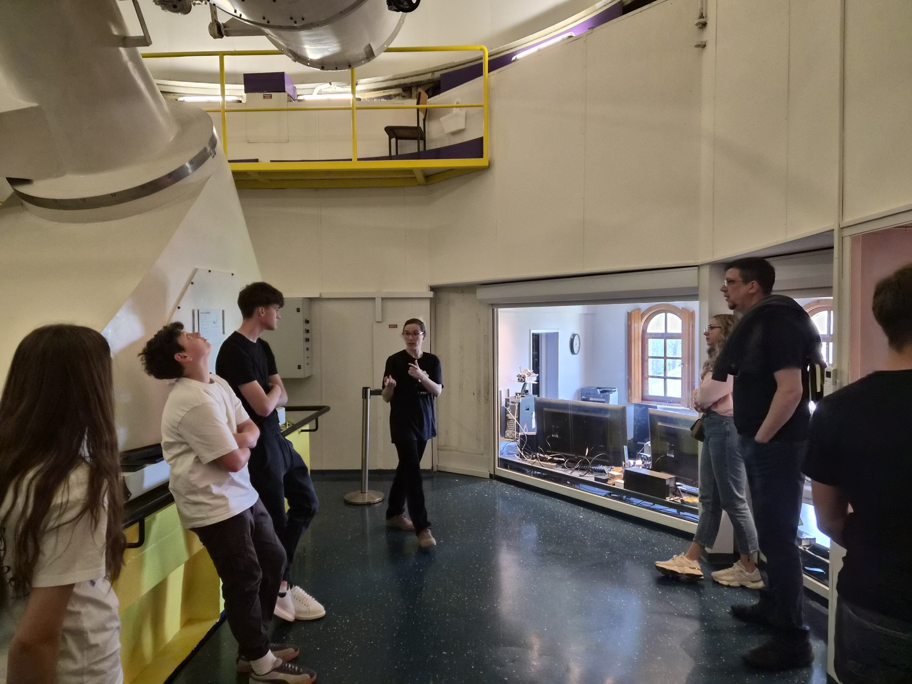
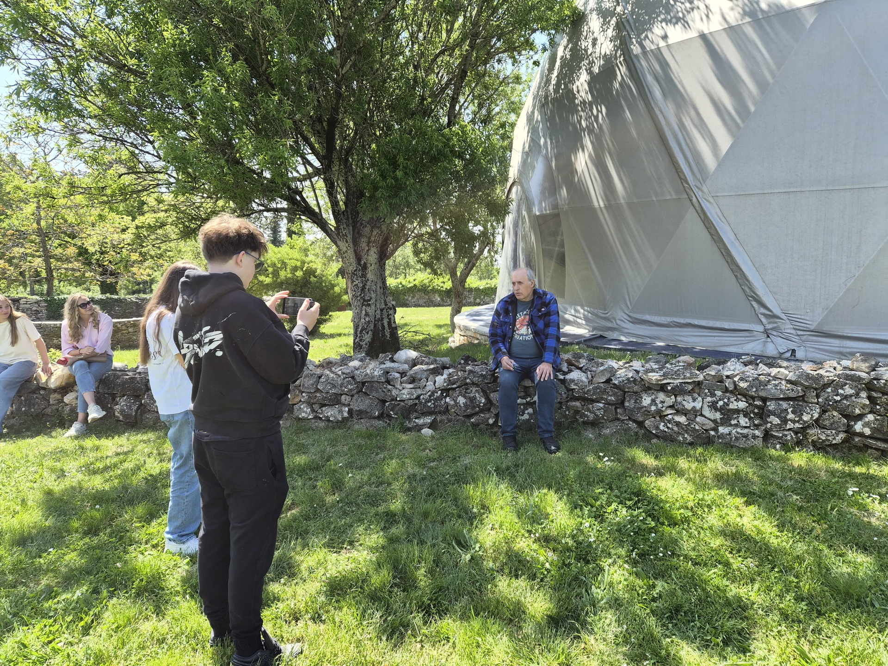

## 24. travnja, Višnjan

Posjet Koradu Korleviću nije bio razgovor o turizmu. Nije bio ni razgovor isključivo o astronomiji. Bio je razgovor o tome kako neko mjesto ostaje živo, i što mu se dogodi kad to prestane biti.

## Zašto baš njega

U cijelom istraživanju do ovog dana, najčešća rečenica koju smo čuli, u različitim varijantama, bila je: "Mladi odlaze." Trebao nam je netko tko je u istom prostoru, u Višnjanu, odlučio raditi suprotno. Tko gradi obrazovni i znanstveni program koji ostaje na mjestu, koji privlači mlade ljude izvana i daje razlog onima iznutra da ne odu.

## O čemu smo razgovarali

Pitanja smo, za razliku od prethodnih sastanaka, držali otvorenija:

- Što jedno mjesto čini *mjestom* kad se izvana gleda samo kao mjesto za odmor?
- Kako se djeci u Istri može dati razlog za znatiželju koji nije proizvedena slika onoga što ovdje postoji?
- Što obrazovanje na lokalnoj razini može, a što su iluzije?
- Kakvu Istru njegovi učenici opisuju kad ih netko pita "gdje vidiš sebe za dvadeset godina"?

Dosta razgovora otišlo je u smjer koji nismo planirali, ali nam to nije smetalo. Vraćat ćemo se ovim odgovorima više nego jednom.

## Snimanje

Korlević je sjajan pripovjedač i nismo ga htjeli prekidati postavljanjem opreme. Glavna kamera je bila S26 Ultra, jer nam je trebala dobra slika bez velike kamere koja bi promijenila ton razgovora.

Snimali smo u LOG profilu, jer nam je u opservatoriju svjetlo bilo izrazito miješano (topla žarulja iznutra, plava sjena oko teleskopa). Ključne kadrove smo snimali u APV-u u 4K, da nam slika ostane čista i kad ju u montaži pomičemo po boji. Jedan član tima je paralelno, na drugom mobitelu, snimao samo zvuk za sinkronizaciju.

Audio razgovora smo navečer pustili kroz Audio Eraser, da smanjimo šum klima uređaja koji nam je bio pod stolom. Bez toga nam se taj šum vukao kroz pola snimke.

## Što odnosimo

Iz Višnjana smo se vratili s manjim brojem konkretnih brojki, ali s puno većim osjećajem što tražimo u ostatku materijala. Nije svako mjesto koje izgleda da odlazi stvarno na putu nestajanja. Pitanje je tko u njemu radi sljedeći potez.
